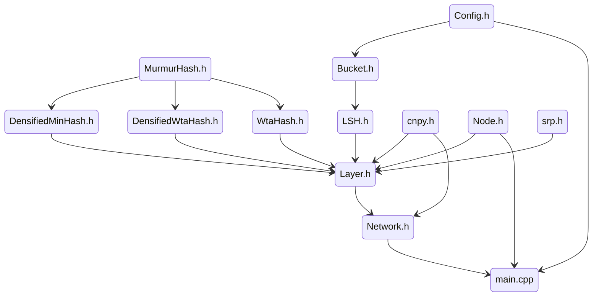

# SLIDE: Sub-LInear Deep learning Engine

## Introduction

SLIDE (Sub-LInear Deep learning Engine) is an innovative deep learning system designed for efficient training and inference of large neural networks, particularly on CPU architectures. It distinguishes itself by leveraging smart randomized algorithms, specifically Locality Sensitive Hashing (LSH), to achieve significant computational speedups without sacrificing accuracy. SLIDE aims to demonstrate that with algorithmic ingenuity, CPUs can outperform GPUs in certain deep learning tasks, challenging the conventional reliance on hardware acceleration.

## Key Features and Advantages

- **CPU-Centric Design:** SLIDE is optimized for CPUs, making it accessible and cost-effective, removing the need for specialized GPU hardware.
- **Algorithmic Efficiency:**  At its core, SLIDE employs Locality Sensitive Hashing (LSH) to induce adaptive sparsity in neural networks. This reduces computational overhead by focusing on a dynamically selected subset of neurons during forward and backward passes.
- **High Performance:** By smartly blending randomized algorithms with multi-core parallelism and workload optimization, SLIDE achieves remarkable performance, often outperforming optimized TensorFlow implementations on high-end GPUs in terms of training speed and efficiency.
- **Scalability:** SLIDE exhibits excellent scalability with increasing CPU cores due to its asynchronous parallelization approach, effectively utilizing multi-core architectures.
- **Memory Efficiency:** The sparse nature of computations in SLIDE leads to reduced memory access and footprint, alleviating memory bottlenecks commonly encountered in deep learning workloads.
- **OpenMP Parallelism:** SLIDE leverages OpenMP for straightforward and efficient parallelization across multiple CPU cores.

## Architecture Overview

[Diagram of SLIDE Architecture will be inserted here]

## Reference Paper

SLIDE is based on the research paper: **"SLIDE: In Defense of Smart Algorithms over Hardware Acceleration for Large-Scale Deep Learning Systems"**.  The paper demonstrates that SLIDE, running on a multi-core CPU, can significantly outperform TensorFlow on a Tesla V100 GPU for certain workloads, particularly large fully connected networks used in extreme classification tasks.  Key findings include:

- **Significant Speedup:** SLIDE achieves up to 3.5x speedup over TensorFlow-GPU and 10x speedup over TensorFlow-CPU in training time while maintaining comparable accuracy.
- **CPU Efficiency:**  Performance analysis reveals that SLIDE exhibits better CPU core utilization and reduced memory-bound inefficiencies compared to TensorFlow-CPU.
- **Adaptive Sampling:** The paper highlights the effectiveness of LSH-based adaptive neuron sampling compared to static sampling methods like sampled softmax.

For more in-depth information, please refer to the original paper: [https://arxiv.org/abs/1903.03129](https://arxiv.org/abs/1903.03129)

## Installation and Basic Usage

To build and run SLIDE, follow these general steps:

1. **Dependencies:** Ensure you have CMake (v3.0 or higher) and a C++11 compliant compiler installed. Transparent Huge Pages should be enabled on Linux systems for optimal performance.
2. **Build Process:** Use CMake to configure and build the project. Typically, this involves creating a build directory, navigating into it, and running `cmake ..` followed by `make`.
3. **Configuration:** Modify the configuration files (e.g., `SLIDE/Config_amz.csv`) to set parameters for your experiments, such as dataset paths and network configurations.
4. **Execution:** Run the compiled executable (e.g., `runme`) with the configuration file as an argument.

Refer to the `README.md` file in the project root for more detailed instructions and dependency information.

## Source Code Reference Graph 

